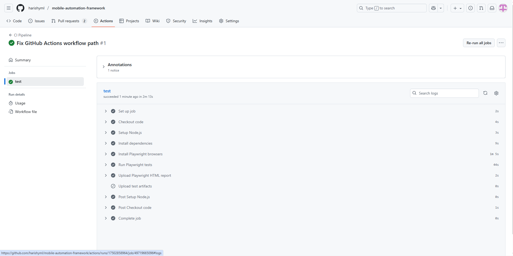

# Mobile Automation Framework

This project is a mobile automation framework for testing the **[SauceDemo](https://www.saucedemo.com/)** sample web app using **Playwright**.  
It simulates real device environments (**iPhone 13** and **Pixel 5**) and validates common e-commerce workflows like login, navigation, adding products to cart, and checkout.


---
## Installation
Clone the repository and install dependencies:

```sh
git clone https://github.com/harishyml/mobile-automation-framework.git
cd mobile-automation-playwright
npm install
```
---

## Install Playwright browsers:

```sh
npx playwright install
```

## Running Tests

Run all tests with a single command and to view report

```sh
npx playwright test 
npx playwright show-report
```
---

## Running a Subset of Tests

Run all tests with a single command:

```sh
npx playwright test login.spec.js
npx playwright test navigation.spec.js 
```
Follow the same for other tests files

Run on a specific device (from `playwright.config.js`):

```sh
npx playwright test --project="iPhone 13"
npx playwright test --project="Pixel 5 (Android)"

```

## Headed vs. Headless Execution

 By default, Playwright runs in **headless mode** (browser UI not visible)
 To run in **headed mode** (see the browser while tests execute), pass the `--headed` flag:

  ```sh
    npx playwright test --headed 
  
  ```
     Useful for debugging when you want to visually confirm actions.
---


## Flows & Scenarios Covered

- **Login**  
  - Valid login (multiple users from `users.json`)  
  - Invalid login (locked user, wrong credentials) 

- **Navigation and Logout**  
  - Navigate between products and logout

- **Cart Management**  
  - Add single product
  - Add multiple products (data-driven from `products.json`)  

 - **Checkout**  
  - Fill form inputs (first name, last name, zip)
  - Complete checkout flow

 - **Error Validation**  
  - Invalid login error messages
  - Complete checkout flow

 - **Responsive Layout**  
  - Check UI on different mobile viewports
   
---

- **Project Structure:**  
  - `src/pages/` - Page Object classes (`loginPage.js, productPage.js, homePage.js`)
  - `src/tests/` - Test specs (`login.spec.js`, `navigation.spec.js`, etc.)
  - `src/data/` - Test data (`users.json`,`products.json`)
  - `src/setup/` - Reusable setup logic (`loginSetup.js`)
  - `playwright.config.js` - Test runner, device emulation, retries, reporting   

 ## Design Notes

- **Page Object Model(POM)** 
   - Each screen (Login, Product, Home) has its own class for reusability.

- **Data-Driven Tests** 
  - Credentials and product sets are read from JSON files.

- **Flaky Test Handling:**  
 - Configured retries: 2 in `Playwright config.js` and Sample flaky test included.
   
- **Wait Strategies**   
  - Explicit waits (toBeVisible, toHaveCount) used for reliable assertions.

- **Reporting & Logging:**  
  - HTML reports are generated and stored in `reports/html/`.  
  - Screenshots and videos are automatically captured on failure.  
  - `test-results/` contains artifacts, including screenshots and videos, for debugging failed runs.  
     
- **Emulator / Viewport Mode:**  
  - Simulates `iPhone 13 (WebKit)` and `Pixel 5 (Chromium)`.

- **Reporting:**  
  - Jest HTML reports make it easy to see test results.


### Why the Framework is Structured This Way

- **Clear Separation:** Pages, test cases, test data, and setup logic are kept in separate folders.  
- **Reusable Code:** Common actions like login and product interactions are centralized for reuse.  
- **Easy to Maintain:** Each module has a single responsibility, making debugging and updates simple.  
- **Scalable:** New pages, tests, or datasets can be added without impacting existing ones.  
- **Robust Tests:** Screenshots, videos, and retries make tests reliable against flaky issues.  
- **Data-Driven:** Products and inputs are stored in JSON files, enabling multiple scenarios without code changes.  


**Known Limitations:**  
- Focused on web mobile emulation (not native Android/iOS apps).  
- Limited to workflows supported by SauceDemo.  
- For real apps, Appium/Espresso/XCUITest integration would be needed..


## GitHub Actions CI Workflow

- Workflow file: `.github/workflows/ci.yml`  
- Runs automatically on:
  - `push` to `main` or any `feature/*` branch  
  - Pull requests
- Uses **Windows runner**: `runs-on: windows-latest`  

- Steps executed:
  1. Checkout repository
  2. Setup Node.js (v18)
  3. Install dependencies (`npm ci`)
  4. Install Playwright browsers (`npx playwright install --with-deps`)
  5. Run Playwright tests (`npx playwright test --reporter=html`)
  6. Upload test report (HTML report as artifact)
  7. Upload test results (screenshots/videos on failure)


## CI Run Action Flow Sceenshot
- GitHub Actions workflow successfully executed tests.
  


